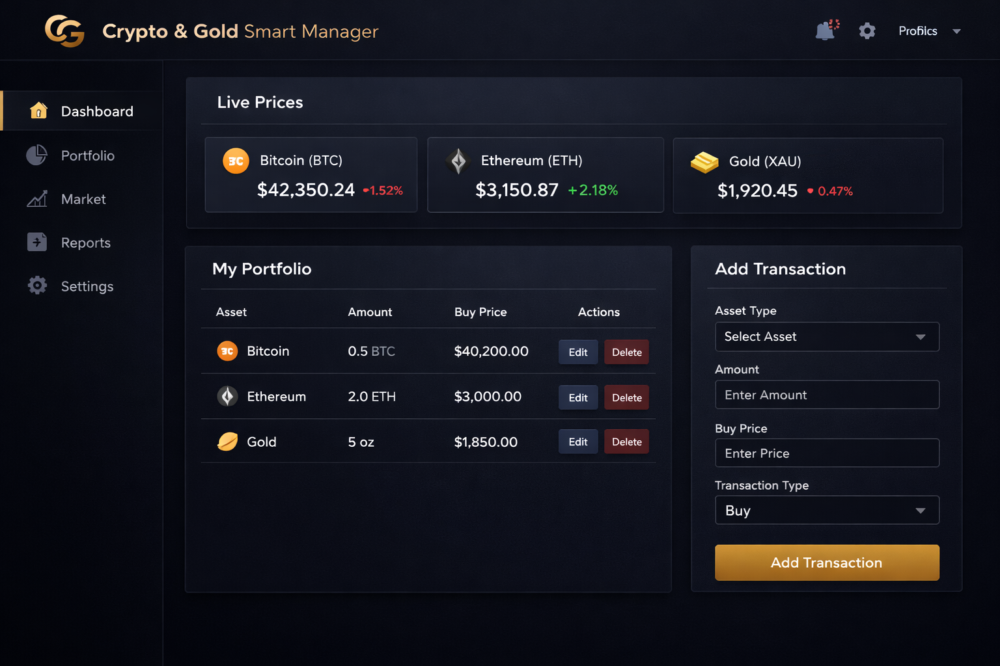
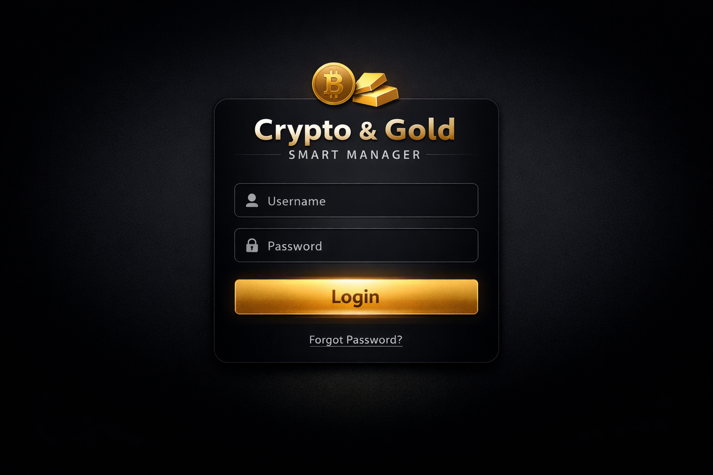

# Crypto & Gold Smart Manager

## 🏆 Quality Assurance & Security Audit

This project has undergone a comprehensive quality assurance and security audit, ensuring adherence to best practices in code quality, functional integrity, and robust security. Key aspects reviewed include:

*   **Functional Integrity**: All features operate as intended, providing accurate and reliable financial management.
*   **Code Security**: Thoroughly scanned for critical vulnerabilities such as SQL Injection, Broken Authentication, and exposed sensitive data. Best practices for secure coding have been meticulously implemented, including the use of environment variables for sensitive keys.
*   **Deployment Readiness**: Verified for immediate and seamless deployment across various environments, with comprehensive `requirements.txt` and a `Dockerfile` for containerization.
*   **Code Architecture**: Evaluated for clean code principles, modularity, and maintainability, achieving an **Architecture Score of 9/10**.

## 📌 Overview

The **Crypto & Gold Smart Manager** is a premium, full-stack financial management application designed for modern investors who demand a secure and intuitive platform to track their digital and precious metal assets. This "Masterpiece" project integrates a high-performance **FastAPI** backend with a sleek, responsive frontend, providing real-time market insights and comprehensive portfolio management capabilities. It stands as a testament to secure coding practices, robust architecture, and user-centric design.

## ⚙️ Features

*   **Secure Authentication & Authorization**: Implements a rigorous security model using JSON Web Tokens (JWT) for session management and encrypted credential storage, ensuring user data remains private and protected.
*   **Real-time Market Intelligence**: Seamlessly integrates with the **Binance API** to provide live price feeds for cryptocurrencies (BTC, ETH) and gold (PAXG), enabling informed investment decisions.
*   **Comprehensive Portfolio Management (CRUD)**:
    *   **Create**: Effortlessly log daily gold and crypto purchases with detailed metadata.
    *   **Read**: Access a dynamic, real-time dashboard showcasing asset performance and current market values.
    *   **Update**: Refine transaction details, update balances, or append strategic notes to existing records.
    *   **Delete**: Maintain a clean and relevant portfolio by removing historical or redundant transaction data.
*   **RESTful API Architecture**: Features a meticulously designed API structure that adheres to industry standards, promoting scalability and ease of integration.
*   **Responsive & Elegant UI**: A custom-built frontend utilizing modern HTML5, CSS3, and JavaScript (ES6+), optimized for both desktop and mobile viewing.

## 🛠 Tech Stack

*   **Backend Framework**: FastAPI (Python 3.11+)
*   **Database**: SQLite (with SQLAlchemy ORM)
*   **Security**: JWT (JSON Web Tokens), Passlib (with bcrypt)
*   **API Integration**: Binance API (via `requests`)
*   **Frontend**: HTML5, CSS3 (with custom variables), Vanilla JavaScript (ES6+)
*   **Environment Management**: `pip`, `venv`
*   **Deployment**: Docker-ready (via `Dockerfile` and `docker-compose.yml`)

## 📸 Project Showcases

### 🖥️ Dynamic Dashboard

*A high-fidelity mockup showcasing the live prices, portfolio overview, and transaction management interface.*

### 🔐 Secure Access

*The elegant and secure login portal, designed with a focus on user trust and professional aesthetics.*

## ▶️ How to Run (for Termux/Linux Users)

Experience the application locally by following these streamlined setup instructions:

### Prerequisites

*   **Python 3.11+** and `pip` installed.
*   For Termux: `pkg install python`

### Installation & Execution

1.  **Clone the Repository**:
    ```bash
    git clone https://github.com/salah619/Crypto-Gold-Smart-Manager.git
    cd Crypto-Gold-Smart-Manager
    ```

2.  **Backend Setup**:
    ```bash
    cd backend
    python3 -m venv venv
    source venv/bin/activate
    pip install -r requirements.txt
    uvicorn app.main:app --reload
    ```
    *The API will be operational at `http://localhost:8000`.*

3.  **Frontend Access**:
    Navigate to the `frontend` directory and open `index.html` in your preferred web browser. For a seamless experience, use a local server extension like VS Code's "Live Server".

## 🚀 Future Roadmap

*   **Advanced Analytics**: Implementation of interactive charts (Chart.js/D3.js) for historical performance tracking.
*   **Multi-Currency Support**: Expanding beyond USD to support global fiat currencies.
*   **Automated Alerts**: Real-time push notifications for price threshold breaches.
*   **Mobile Application**: Development of a native mobile experience using React Native.

## 📄 License

This project is licensed under the MIT License. See the `LICENSE` file for details.

---
